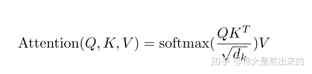

## 一篇很好的注意力机制的blog
[链接地址](https://zhuanlan.zhihu.com/p/410776234)  

  
上图是attention机制的公式，我们也可将公式简化成$Softmax(XX^T)X$

其中，$XX^T$ 是$X$ 的内积，向量的内积代表两个向量的夹角，代表一个向量在另一个向量上的投影。

上图模拟了$XX^T$ 的过程

首先，行向量 ![[公式]](https://www.zhihu.com/equation?tex=x_i%5ET) 分别与自己和其他两个行向量做内积（"早"分别与"上""好"计算内积)，得到了一个新的向量。我们回想前文提到的**向量的内积表征两个向量的夹角，表征一个向量在另一个向量上的投影**。

**投影的值大，说明两个向量相关度高**。

**我们考虑，如果两个向量夹角是九十度，那么这两个向量线性无关，完全没有相关性！**

更进一步，这个向量是词向量，是词在高维空间的数值映射。词向量之间相关度高表示什么？是不是**在一定程度上**（不是完全）表示，在关注词A的时候，应当给予词B更多的关注？

上图展示了一个行向量运算的结果，那么矩阵 $XX^T$  的意义是什么呢？

**矩阵** $XX^T$  **是一个方阵，我们以行向量的角度理解，里面保存了每个向量与自己和其他向量进行内积运算的结果。**

接下来，$Softmax$ 的作用为归一化，就是这些归一化之后的数字。当我们关注"早"这个字的时候，我们应当分配0.4的注意力给它本身，剩下0.4关注"上"，0.2关注"好"。当然具体到我们的Transformer，就是对应向量的运算了。