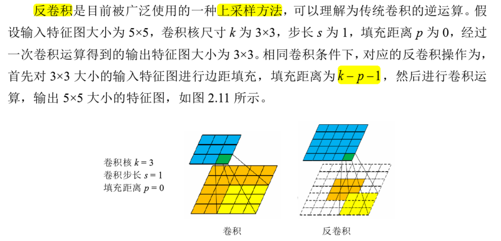
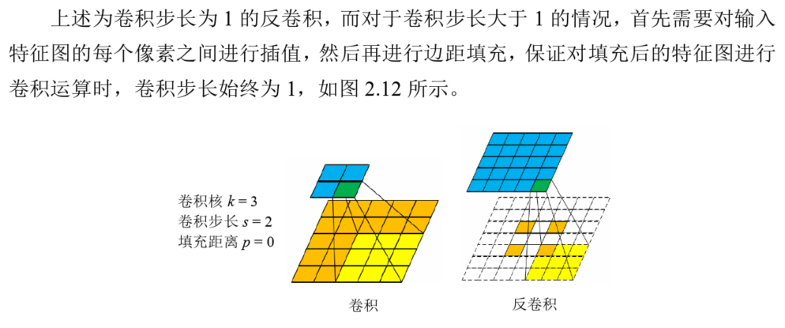

### 一、标注两个初学者的点

    1. 卷积核(kernel_size)通常情况都是奇数，因为方便same padding时的处理，可以将padding补充的0放在两侧对称分布
    2. 在same padding时 padding的大小设置成kernel_size的一半
`
    self.conv1 = nn.Conv2d(num_channels, 64, kernel_size=9, padding=9 // 2)
    self.conv2 = nn.Conv2d(64, 32, kernel_size=5, padding=5 // 2)
    self.conv3 = nn.Conv2d(32, num_channels, kernel_size=5, padding=5 // 2)
    self.relu = nn.ReLU(inplace=True)
`

### 二、当运行这样需要参数的代码
`
    parser = argparse.ArgumentParser()
    parser.add_argument('--train-file', type=str, required=True)
    parser.add_argument('--eval-file', type=str, required=True)
    parser.add_argument('--outputs-dir', type=str, required=True)
`
python train.py --train-file BLAH_BLAH/91-image_x3.h5 --eval-file BLAH_BLAH/Set5_x3.h5 --outputs-dir BLAH_BLAH/outputs
直接--加参数名 参数值 即可 不需要加""

参数名中的-在后面参数中会自动转成_
e.g.  --outputs-dir -->  args.outputs_dir

### 三、卷积核（kernel）和过滤器（filter）的区别
1. 卷积核就是由长和宽来指定的，是一个二维的概念。
2. 而过滤器是是由长、宽和深度指定的，是一个三维的概念。过滤器可以看做是卷积核的集合。

即： 一个过滤器就对应一个特征图。

### 四、机器学习中的ground truth
在监督学习中，数据都是有标注的，以(x, t)的形式出现，其中x是输入数据，t是标注。 正确的t标注就是ground truth

baseline:
所谓baseline，就是用最原始最简单的方法实现任务。(因此就有了strong baseline的概念，可以用较强的对比组模型)
将baseline作为对照，我们不断提升算法性能，不然没有对比，无法体现算法的优劣。

### 五、Ablation Study - 消融实验
将最终的模型进行简化，以研究模型中不同部分(components)的影响
立场提取和推理网络中的消融实验
1. 验证post-reply pair的作用，消融成只使用post和reply的平均向量去做classification
2. 消融掉推理图网络，只使用所有立场表示的平均值进行检测
3. 忽略模型中的可视化信息，并保持其他组件不变
4. 消融掉句子引导的注意力层，直接把文本特征和图片特征聚合为此模型中的多模态特征代表

### 六、上采样和反卷积
上采样一些常见的方法有：近邻插值（nearest interpolation）、双线性插值(bilinear interpolation)，双三次插值（Bicubic interpolation），
反卷积(Transposed Convolution)，反池化(Unpooling)

[链接](https://www.zhihu.com/question/328891283/answer/1604072340)

    
