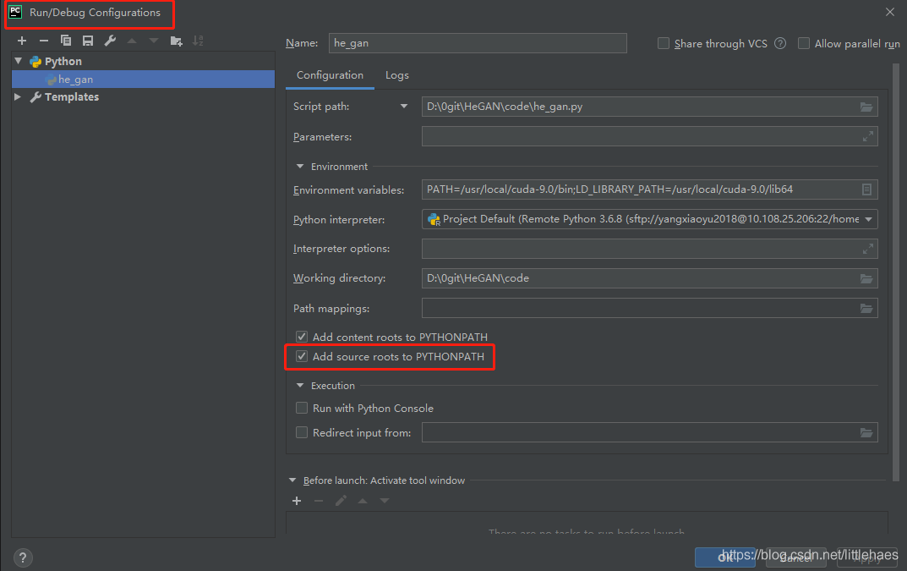
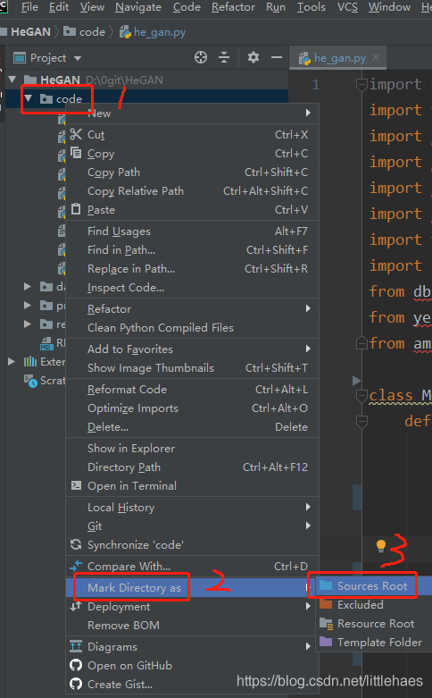

使用from…import添加非python的包时, 需要为python解释器指定搜索路径, 比如
使用sys.path.insert(), 还可以指定PYTHONPATH, 我用的是PYTHONPATH, 编辑run的配置文件
时突然看到"Add source roots to PYTHONPATH", 又突然联想到Mark Directory as, 
于是就觉得把文件夹Mark Directory as成root就不用手动添加PYTHONPATH了, 果不其然

将文件夹Mark Directory as成source root的方法

  
  
  
python在导入文件的时候就使用相对路径（或者绝对路径）就好

